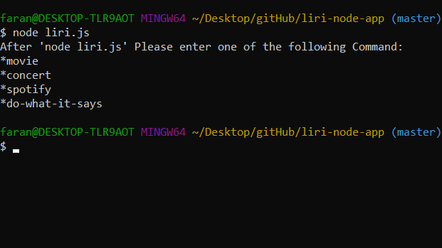
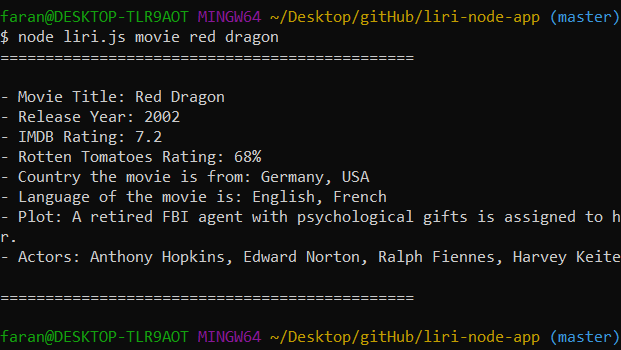
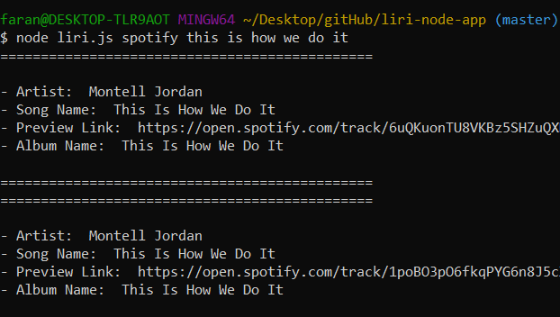
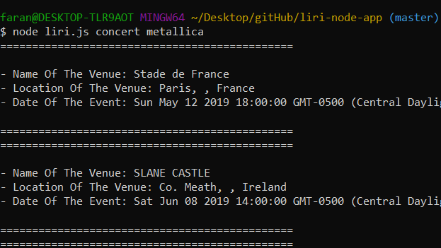
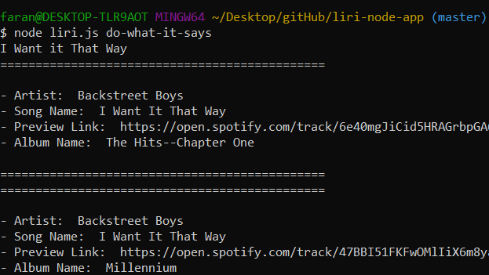

# LIRI Application With Node.js

## What is LIRI?
LIRI is like iPhone's SIRI. However, while SIRI is a Speech Interpretation and Recognition Interface, LIRI is a Language Interpretation and Recognition Interface. LIRI will be a command line node app that takes in parameters and gives you back data.

## What can LIRI search and what will it show in result?
1. Bands In Town API: 
- Will take a band name and in return you'll see:
    - Name of the venue
    - Location of the venue
    - Date of the event

2. OMDB Movie API:
- Will take a movie name and in return you'll see:
    - Title of the movie.
    - Year the movie came out.
    - IMDB Rating of the movie.
    - Rotten Tomatoes Rating of the movie.
    - Country where the movie was produced.
    - Language of the movie.
    - Plot of the movie.
    - Actors in the movie.

3. Spotify API:
- Will take a song name and in return you'll see:
    - Artist(s)
    - The song's name
    - A preview link of the song from Spotify
    - The album that the song is from

## How does LIRI works?
1. Open your terminal and go to the root of the LIRI application file.
2. Then in terminal enter `node liri.js` and press Enter to get a list of action command.

3. Now pick an action commmand and input your search inquiry after that, for example: `node liri.js movie red dragon` or `node liri spotify this is how we do it` or `node liri.js concert metallica` and press Enter.

### * If there is no input after movie or spotify, there is a default set for these commands, that will show a set data.

4. As you see, there is a 4th command in this app as well. This command will go to the random.txt file and grab an input from there and runs spotify API.

## For further help, please leave a commment or reach me at:
## Faran.navazi@gmail.com

## Contributer/s:
   - Faran Navazi